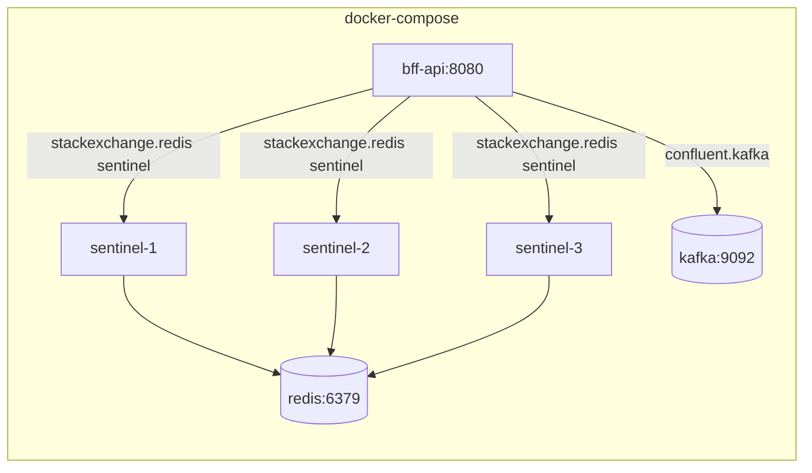

# 08 — Deployment

> **Status:** 🟡 Draft
> **Audience:** SRE, platform engineers
> **Goal:** Define how the BFF API is packaged, shipped, and operated in local, CI, and production environments.

---

## 8.1 Local: docker-compose

The `docker/docker-compose.yml` brings up the **full stack** the BFF needs:

- `redis` — single-node Redis 7 with `requirepass` and AOF persistence.
- `redis-sentinel` — 3-node Sentinel quorum for HA in dev.
- `kafka` — KRaft single-broker Kafka 3.7 with auto topic creation on.
- `bff-api` — the BFF image built from the repo root.



Bring it up:

```bash
cd docker
docker compose up -d
docker compose ps
curl http://localhost:8080/api/v1/health/ready
```

---

## 8.2 Container image

Multi-stage Dockerfile, framework-dependent (smaller, faster, runs as non-root):

```dockerfile
# --- build ---
FROM mcr.microsoft.com/dotnet/sdk:10.0 AS build
WORKDIR /src
COPY FleetStream.sln .
COPY src/Core/*.csproj           src/Core/
COPY src/Application/*.csproj     src/Application/
COPY src/Infrastructure/*.csproj  src/Infrastructure/
COPY src/Presentation/*.csproj    src/Presentation/
RUN dotnet restore src/Presentation/FleetStream.Presentation.csproj
COPY . .
RUN dotnet publish src/Presentation/FleetStream.Presentation.csproj \
    -c Release -o /app/publish /p:UseAppHost=false

# --- runtime ---
FROM mcr.microsoft.com/dotnet/aspnet:10.0
WORKDIR /app
COPY --from=build /app/publish .
RUN groupadd -r fleetstream && useradd -r -g fleetstream -u 10001 fleetstream
USER 10001
EXPOSE 8080
HEALTHCHECK --interval=30s --timeout=5s --start-period=10s --retries=3 \
  CMD wget --no-verbose --tries=1 --spider http://localhost:8080/api/v1/health/live || exit 1
ENTRYPOINT ["dotnet", "FleetStream.Presentation.dll"]
```

- **Base image** is the official `mcr.microsoft.com/dotnet/aspnet:10.0` (Debian-slim).
- **No root** — UID 10001.
- **No package manager** in the runtime image.
- **HEALTHCHECK** points to `/api/v1/health/live`.

---

## 8.3 Kubernetes (reference manifests)

> These are illustrative; the real cluster manifests live in the platform repo.

```yaml
apiVersion: apps/v1
kind: Deployment
metadata:
  name: fleetstream-bff
  labels: { app: fleetstream-bff }
spec:
  replicas: 3
  strategy:
    type: RollingUpdate
    rollingUpdate:
      maxSurge: 1
      maxUnavailable: 0
  selector:
    matchLabels: { app: fleetstream-bff }
  template:
    metadata:
      labels: { app: fleetstream-bff }
      annotations:
        prometheus.io/scrape: "true"
        prometheus.io/port:   "8080"
        prometheus.io/path:   "/metrics"
    spec:
      securityContext:
        runAsNonRoot: true
        runAsUser:    10001
        fsGroup:      10001
      containers:
        - name: bff
          image: ghcr.io/fleetstream/bff:1.0.0
          ports:
            - name: http
              containerPort: 8080
          env:
            - { name: ASPNETCORE_ENVIRONMENT,         value: Production }
            - { name: ASPNETCORE_URLS,                value: http://+:8080 }
            - { name: ConnectionStrings__Redis,        valueFrom: { secretKeyRef: { name: bff-secrets, key: redis } } }
            - { name: ConnectionStrings__Kafka,        valueFrom: { secretKeyRef: { name: bff-secrets, key: kafka } } }
            - { name: Jwt__JwksUri,                    valueFrom: { secretKeyRef: { name: bff-secrets, key: jwks-uri } } }
            - { name: OpenTelemetry__OtlpEndpoint,     value: http://otel-collector:4317 }
          readinessProbe:
            httpGet: { path: /api/v1/health/ready, port: http }
            initialDelaySeconds: 5
            periodSeconds: 10
          livenessProbe:
            httpGet: { path: /api/v1/health/live,  port: http }
            initialDelaySeconds: 15
            periodSeconds: 20
          resources:
            requests: { cpu: 250m, memory: 256Mi }
            limits:   { cpu: 1000m, memory: 512Mi }
```

**PodDisruptionBudget:**

```yaml
apiVersion: policy/v1
kind: PodDisruptionBudget
metadata: { name: fleetstream-bff }
spec:
  minAvailable: 2
  selector:    { matchLabels: { app: fleetstream-bff } }
```

**HPA** (optional, Phase 4+):

```yaml
apiVersion: autoscaling/v2
kind: HorizontalPodAutoscaler
metadata: { name: fleetstream-bff }
spec:
  scaleTargetRef: { apiVersion: apps/v1, kind: Deployment, name: fleetstream-bff }
  minReplicas: 3
  maxReplicas: 12
  metrics:
    - type: Resource
      resource: { name: cpu, target: { type: Utilization, averageUtilization: 70 } }
```

---

## 8.4 Scaling characteristics

| Resource            | Per pod                  | Notes                                                |
| ------------------- | ------------------------ | ---------------------------------------------------- |
| CPU                 | 250 m req / 1000 m limit | Tuning target: < 70 % at 1,000 RPS summary traffic.   |
| Memory              | 256 Mi req / 512 Mi limit | Working set dominated by `StackExchange.Redis` pool.  |
| Concurrent WS       | 10,000                   | Empirical; bump in M5 if `signalr_connections_active` > 8 k. |
| Kafka partitions    | 12 (telemetry) + 6 (alerts) | Match `parallelism = min(pods, partitions)`.         |

---

## 8.5 Rolling deploy

- `maxSurge: 1`, `maxUnavailable: 0` → zero-downtime.
- Pods come up, register with Redis backplane, and start consuming Kafka before `/ready` flips to 200.
- The Kafka consumer offsets are committed **per partition**, not per pod, so a new pod resumes exactly where the old one left off.

---

## 8.6 Blue/green

- Run a second Deployment `fleetstream-bff-green` with the new image; switch the Service selector.
- The `green` pods join the same Redis backplane and the same Kafka consumer group; in-flight SignalR connections are **not** migrated (clients reconnect to the new selector and call `RequestSnapshot()`).
- Rollback is just "switch the selector back".

---

## 8.7 Disaster recovery

| Failure               | RTO target | RPO target | Procedure                                                   |
| --------------------- | ---------- | ---------- | ----------------------------------------------------------- |
| Single BFF pod        | 30 s       | 0          | Kubernetes recreates the pod; clients reconnect.            |
| Redis primary down    | 30 s       | 0          | Sentinel promotes a replica; the BFF reconnects via the new master. |
| Redis cluster failure | 5 min      | ≤ 24 h     | Rebuild from snapshot; replay Kafka from latest checkpoint. |
| Kafka broker down     | 1 min      | 0          | Kafka controller re-elects; consumer rebalances.            |
| Full region loss      | 30 min     | ≤ 5 min    | Fail over DNS; new region bootstraps from Kafka MirrorMaker. |

The BFF itself is **stateless** (state lives in Redis + Kafka). Horizontal scaling and replacement are trivial.

---

## 8.8 Acceptance criteria for this document

- [ ] `docker compose up -d` brings all 5 services to healthy in < 60 s on a developer laptop.
- [ ] `docker inspect` shows the BFF image runs as UID 10001, not root.
- [ ] A rolling deploy of a single replica change in the example Deployment completes in < 60 s with zero 5xx.
- [ ] A simulated Redis primary kill completes failover in < 30 s with zero lost messages.
- [ ] The image size is < 250 MB.
