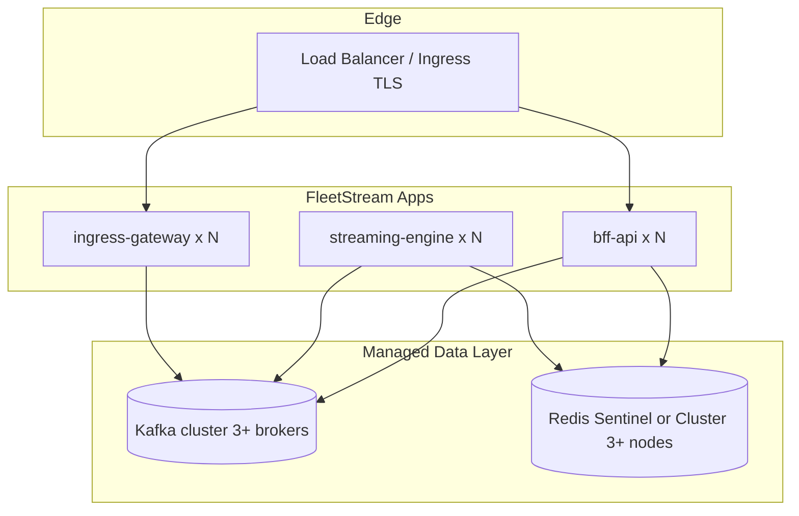

# FleetStream — HA Infrastructure Topology

> **Scope:** Production Redis and Kafka deployment patterns  
> **Last updated:** 2026-08-31

---

## Overview

Local development uses single-node Redis and Kafka via [docker-compose.yml](../../docker-compose.yml). Production requires managed or self-hosted HA clusters. Application code supports:

- **Redis:** single-node (`REDIS_ADDR`) or cluster mode via streaming-engine config
- **Kafka:** TLS + SASL to any broker list; consumer groups enable horizontal scaling of streaming-engine

---

## Recommended production topology



---

## Kafka

| Setting | Dev (compose) | Production |
|---|---|---|
| Brokers | 1 (`kafka:9092`) | 3+ with rack awareness |
| Replication factor | 1 | ≥ 3 for `fleet.telemetry.*` topics |
| Security | PLAINTEXT | TLS + SASL (SCRAM-SHA-512) |
| Topics | auto-create | Pre-provision with RF=3, min.insync.replicas=2 |

**Topic inventory:**

| Topic | Producers | Consumers |
|---|---|---|
| `fleet.telemetry.raw` | ingress-gateway | streaming-engine |
| `fleet.telemetry.processed` | streaming-engine | bff-api |
| `fleet.alerts` | streaming-engine | bff-api |
| `fleet.telemetry.dlq` | streaming-engine | ops replay tooling |

**Scaling:** Add streaming-engine replicas; Kafka consumer group rebalances partitions automatically. Target consumer lag < 1000 messages per partition under normal load.

**Managed options:** AWS MSK, Confluent Cloud, Azure Event Hubs (Kafka protocol), Redpanda Cloud.

---

## Redis

| Setting | Dev (compose) | Production |
|---|---|---|
| Mode | Single node | Sentinel (3 nodes) or Cluster (6 nodes) |
| Auth | Optional password overlay | `REDIS_PASSWORD` required |
| Persistence | AOF optional | AOF + RDB snapshots |

**Key patterns:**

| Key pattern | Owner | TTL |
|---|---|---|
| `truck:state:{id}` | streaming-engine | none (live state) |
| `trucks:online` | streaming-engine | set membership |
| `trucks:moving` | streaming-engine | set membership |
| `alert:*` | streaming-engine / bff | configurable |
| `telemetry:history:{id}` | streaming-engine | windowed |

**Managed options:** AWS ElastiCache, Azure Cache for Redis, Redis Cloud.

---

## Application replica guidance

| Service | Min replicas | Scale trigger |
|---|---|---|
| ingress-gateway | 2 | Ingest RPS, queue depth, backpressure state |
| streaming-engine | 2 | Consumer lag, processing latency p99 |
| bff-api | 2 | API RPS, SignalR connection count |

All Deployments in [ops/k8s/](../k8s/) default to 2 replicas. Configure HPA per cluster.

---

## Failure modes

| Failure | Impact | Mitigation |
|---|---|---|
| Single Kafka broker down | Reduced ISR; produce may stall if min.insync.replicas unmet | RF=3, rack awareness |
| Redis primary failover | Brief write unavailability (Sentinel) | Client retry; streaming-engine idempotent writes |
| ingress-gateway pod crash | In-flight requests dropped | LB health checks; multiple replicas |
| streaming-engine lag spike | Stale dashboard state | HPA on lag; alert on `fleetstream_streaming_consumer_lag` |

---

## Dev vs production compose

```bash
# Dev (single-node, optional Redis password):
docker compose -f docker-compose.yml -f docker-compose.production.yml --profile dev up -d

# Production profile (JWKS, required secrets — still single-node infra):
docker compose -f docker-compose.yml -f docker-compose.production.yml --profile production up -d
```

For HA validation before cutover, deploy to a staging cluster with managed Kafka/Redis matching production topology.

---

## Related

- [Kubernetes manifests](../k8s/README.md)
- [Secrets management](secrets-management.md)
- [TLS termination](tls-termination.md)
