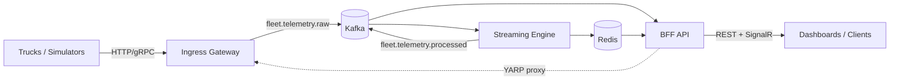

# FleetStream — Production Readiness Report

> **Audit date:** 2026-08-31  
> **Scope:** All production applications in the FleetStream platform  
> **Overall status:** Code-complete — verification and platform gaps remain

---

## Executive summary

FleetStream comprises three deployable applications that form a telemetry ingestion and fleet-management pipeline:

| Layer | Application | Runtime | Role |
|---|---|---|---|
| Edge | [Ingress Gateway](../ingress-gateway/README.md) | Go | Accept truck telemetry (HTTP/gRPC), normalize, publish to Kafka |
| Stream | [Streaming Engine](../streaming-engine/README.md) | Go | Consume raw telemetry, detect anomalies, update Redis state, publish processed events |
| API | [BFF API](../BffApi/README.md) | .NET 10 | REST + SignalR gateway for dashboards; reads Redis/Kafka, proxies to upstreams |

All three applications have completed their **P0 (deployment blockers)**, **P1 (operational stability)**, and **P2 (maintainability)** remediation items from the 2026-08-31 audit. **No application is cleared for production** until the verification sections in each per-app checklist are executed and signed off.

### Readiness at a glance

| Application | P0 | P1 | P2 | Verification | Production ready |
|---|---|---|---|---|---|
| Ingress Gateway | ✅ | ✅ | ✅ | ⬜ Not run | **No** |
| Streaming Engine | ✅ | ✅ | ✅ | ⬜ Not run | **No** |
| BFF API | ✅ | ✅ | ✅ | ⬜ Not run | **No** |
| **Platform (cross-cutting)** | — | — | — | ⬜ Runtime sign-off | **No** |

---

## Platform architecture



**Shared infrastructure** (root [docker-compose.yml](../docker-compose.yml)):

- Redis 7 — truck state, alerts, telemetry history
- Kafka 7.5 (Confluent) + Zookeeper — event bus
- Profiles: `dev` (symmetric JWT, dev token) · `production` (JWKS, no dev endpoints)

---

## Application summaries

### 1. Ingress Gateway (Go)

**Detailed checklist:** [ingress-gateway/production-readiness-checklist.md](ingress-gateway/production-readiness-checklist.md)

| Category | Status | Highlights |
|---|---|---|
| Build | ✅ Resolved | `go.sum` committed; compile errors fixed |
| Ingestion path | ✅ Resolved | Kafka producer wired; gRPC server implemented; stub paths removed |
| Config | ✅ Resolved | 12-factor env/config loading |
| Health | ✅ Resolved | `/health/live`, `/health/ready`; Dockerfile aligned |
| Shutdown | ✅ Resolved | HTTP + gRPC + Kafka producer drain |
| Observability | ✅ Resolved | Correlation ID middleware; Kafka header propagation |
| Tests | ✅ Added | Integration test: HTTP ingest → Kafka topic |

**Key endpoints:** HTTP `:8080`, gRPC `:50051`, metrics `:9090`

**Remaining verification (9 items):** build, docker build, ingest E2E, health probes, metrics, graceful shutdown, structured logs.

---

### 2. Streaming Engine (Go)

**Detailed checklist:** [streaming-engine/production-readiness-checklist.md](streaming-engine/production-readiness-checklist.md)

| Category | Status | Highlights |
|---|---|---|
| Build | ✅ Resolved | `go.sum` committed; DLQ compile error fixed |
| Message correctness | ✅ Resolved | No commit on failure; DLQ wired; exactly-once path |
| Config | ✅ Resolved | All config sections wired from env |
| Health | ✅ Resolved | Admin port `:8081` (decoupled from Kafka `:9092`) |
| Shutdown | ✅ Resolved | Consumer, producer, DLQ, HTTP servers drained |
| Redis | ✅ Resolved | Single-node vs cluster config-driven |
| Observability | ✅ Resolved | Correlation ID; consumer lag gauge; JSON logs |
| Tests | ✅ Added | Integration test: raw → processed pipeline |

**Key endpoints:** metrics `:9091`, health `:8081`

**Remaining verification (10 items):** build, docker build, pipeline E2E, idempotency, DLQ behavior, health probes, metrics, SIGTERM drain, structured logs.

---

### 3. BFF API (.NET 10)

**Detailed checklist:** [bff-api/production-readiness-checklist.md](bff-api/production-readiness-checklist.md)

| Category | Status | Highlights |
|---|---|---|
| Auth | ✅ Resolved | RS256/JWKS in Production; dev token gated to Development |
| Health | ✅ Resolved | Kafka + Redis readiness; Dockerfile path fixed |
| Observability | ✅ Resolved | JSON logs, OTLP, custom `fleetstream_bff_*` metrics |
| Resiliency | ✅ Resolved | Polly v8 on YARP; ValidationDecorator; rate limiting |
| Security | ✅ Resolved | JWT on SignalR; security headers; audit logging |
| API surface | ✅ Resolved | Alerts list, telemetry history, cursor pagination |
| Tests | ✅ Added | Unit, Infrastructure, and API test projects |
| Ops | ✅ Added | Grafana dashboard at `ops/grafana/bff-overview.json` |

**Key endpoints:** API `:8080`, health `/api/v1/health/{live,ready}`, metrics `/metrics`

**Build status (local):** `dotnet build FleetStream.sln` — **0 errors**, 8 warnings (NU1510 package pruning, CS0108, xUnit1031).

**Remaining verification (7 items):** health probes, metrics, auth enforcement, dev-token 404, distributed trace with correlation ID.

---

## Cross-cutting platform assessment

### CI/CD

| Item | Status | Notes |
|---|---|---|
| Streaming Engine CI | ✅ | [.github/workflows/streaming-engine.yml](../.github/workflows/streaming-engine.yml) — build + test on push/PR |
| Ingress Gateway CI | ✅ | [.github/workflows/ingress-gateway.yml](../.github/workflows/ingress-gateway.yml) — build, test, docker |
| BFF API CI | ✅ | [.github/workflows/bff-api.yml](../.github/workflows/bff-api.yml) — build, test, docker |
| Unified pipeline | ✅ | [.github/workflows/verify-production-readiness.yml](../.github/workflows/verify-production-readiness.yml) — cross-service build/test + optional runtime |
| Container registry | ⚠️ | CI builds images locally; publish/tag strategy not yet documented |

### Infrastructure & deployment

| Item | Status | Notes |
|---|---|---|
| Root docker-compose | ✅ | Kafka, Redis, ingress-gateway, streaming-engine |
| BFF production profile | ✅ | JWKS env vars; depends on streaming-engine |
| BFF dev profile | ✅ | Symmetric JWT; includes ingress-gateway |
| Kubernetes manifests | ✅ | [ops/k8s/](../ops/k8s/) — Deployments, Services, Ingress, secret templates |
| Terraform / IaC | ❌ | Not present |
| Secrets management | ✅ | [docs/platform/secrets-management.md](platform/secrets-management.md); `.env.example`, `docker-compose.production.yml` |
| HA Redis / Kafka | ✅ | [docs/platform/ha-topology.md](platform/ha-topology.md) — production topology; dev single-node in compose |

### Observability stack

| Item | Status | Notes |
|---|---|---|
| Prometheus metrics | ✅ | All three services expose `/metrics` |
| Structured JSON logs | ✅ | All three services |
| Correlation ID propagation | ✅ | HTTP → Kafka headers across pipeline |
| OpenTelemetry (BFF) | ✅ | OTLP exporter configured for non-dev |
| Grafana dashboards | ✅ | BFF, ingress-gateway, streaming-engine — `ops/grafana/` |
| Alerting rules | ✅ | `ops/prometheus/alerts.yml` |
| Log aggregation | ❌ | No Loki/ELK/CloudWatch config |

### Security

| Item | Status | Notes |
|---|---|---|
| JWT (Production) | ✅ | JWKS validation on BFF |
| Dev endpoints gated | ✅ | `AuthController` / dev token Development-only |
| TLS termination | ✅ | [docs/platform/tls-termination.md](platform/tls-termination.md); K8s Ingress + Kafka TLS |
| Kafka auth/TLS | ✅ | TLS + SASL env vars wired in all three apps; PLAINTEXT in dev compose |
| Redis auth | ✅ | `REDIS_PASSWORD` required via production overlay |
| mTLS (service-to-service) | ❌ | Not implemented |
| Rate limiting | ✅ | BFF global rate limiter |

### Testing

| Item | Status | Notes |
|---|---|---|
| Streaming Engine unit + integration | ✅ | `internal/*_test.go`, `test/integration/` |
| Ingress Gateway unit + integration | ✅ | `internal/handlers/health_test.go`, `test/integration/` |
| BFF unit tests | ✅ | `FleetStream.UnitTests` |
| BFF infrastructure tests | ✅ | `FleetStream.InfrastructureTests` |
| BFF API tests | ✅ | `FleetStream.ApiTests` |
| Full-stack E2E (automated) | ✅ | `scripts/verify-production-readiness.sh --runtime`; CI runtime job |
| Load test (ingress) | ✅ | `cmd/loadtest` exists; gate not run in CI |

### Out of scope (not yet built)

| Component | Status | Notes |
|---|---|---|
| Frontend / dashboard UI | ❌ | Referenced in [DEVELOPMENT_PHASES.md](../DEVELOPMENT_PHASES.md); no app in repo |
| Graph generator | 🔧 Dev tool | `tools/graph-generator` — architecture visualization, not production |

---

## Verification matrix

Consolidated sign-off checklist. Each row maps to the per-app verification sections.

| # | Test | Ingress | Streaming | BFF | Platform |
|---|---|---|---|---|---|
| 1 | Application builds cleanly | ⬜ | ⬜ | ✅ | — |
| 2 | Docker image builds | ⬜ | ⬜ | ⬜ | — |
| 3 | Liveness probe → 200 | ⬜ | ⬜ | ⬜ | — |
| 4 | Readiness probe → 200 (deps up) / 503 (deps down) | ⬜ | ⬜ | ⬜ | — |
| 5 | Prometheus metrics exposed | ⬜ | ⬜ | ⬜ | — |
| 6 | End-to-end telemetry flow | ⬜ | ⬜ | — | ✅ |
| 7 | Graceful shutdown (SIGTERM) | ⬜ | ⬜ | — | — |
| 8 | Auth enforcement (401 without token) | — | — | ⬜ | — |
| 9 | Dev endpoints blocked in Production | — | — | ⬜ | — |
| 10 | Structured JSON logs with correlation ID | ⬜ | ⬜ | ⬜ | — |
| 11 | CI pipeline green on main | ✅ | ✅ | ✅ | ✅ |

**Suggested E2E validation** (also run automatically via `scripts/verify-production-readiness.sh --runtime`):

```bash
# 1. Start infrastructure + Go services
docker compose up -d redis zookeeper kafka ingress-gateway streaming-engine

# 2. Start BFF (dev profile — host port 8082)
docker compose --profile dev up -d bff-api-dev

# 3. Ingest sample telemetry (ingress on 8080)
curl -X POST http://localhost:8080/ingest -H "Content-Type: application/json" -d '{...}'

# 4. Verify health across stack
curl http://localhost:8080/health/ready          # ingress-gateway
curl http://localhost:8081/health/ready          # streaming-engine
curl http://localhost:8082/api/v1/health/ready   # bff-api (dev profile)

# 5. Verify BFF reads processed state
curl -H "Authorization: Bearer $TOKEN" http://localhost:8082/api/v1/fleet/summary
```

---

## Remaining gaps (prioritized)

### P0 — Must resolve before production

1. ~~**Run and sign off all verification checklists**~~ — **Automated:** `scripts/verify-production-readiness.sh` (+ `--runtime` for docker stack probes); CI workflow on push to main. Manual sign-off of runtime items still required before production cutover.
2. ~~**Add CI workflows** for ingress-gateway and BFF API (build, test, docker build).~~ ✅ Done — see `.github/workflows/`.
3. ~~**Define secrets strategy**~~ ✅ Done — [docs/platform/secrets-management.md](platform/secrets-management.md); Redis password + Kafka TLS/SASL env vars in production overlay.

### P1 — Required for operational confidence

4. ~~**Automated full-stack E2E test** in CI (docker-compose or testcontainers).~~ ✅ Done — `scripts/verify-production-readiness.sh --runtime` validates ingest → process → BFF state read; CI runtime job in `verify-production-readiness.yml`.
5. ~~**Production infrastructure** — Kubernetes manifests or equivalent; HA Redis/Kafka topology.~~ ✅ Done — [ops/k8s/](../ops/k8s/); [HA topology](platform/ha-topology.md).
6. ~~**Grafana dashboards** for ingress-gateway and streaming-engine; Prometheus alert rules.~~ ✅ Done — `ops/grafana/ingress-gateway-overview.json`, `ops/grafana/streaming-engine-overview.json`; `ops/prometheus/alerts.yml`.
7. ~~**TLS termination** documented and configured at edge load balancer or service mesh.~~ ✅ Done — [docs/platform/tls-termination.md](platform/tls-termination.md); K8s Ingress manifest with TLS.

### P2 — Maintainability and completeness

8. **Frontend application** — not started; required for end-user fleet visualization per product vision.
9. **Unified monorepo CI** — matrix build across all services on every PR.
10. **Resolve BFF build warnings** — NU1510 package pruning, CS0108 hiding, xUnit1031 async pattern.

---

## Per-application checklists

| Application | Checklist |
|---|---|
| Ingress Gateway | [docs/ingress-gateway/production-readiness-checklist.md](ingress-gateway/production-readiness-checklist.md) |
| Streaming Engine | [docs/streaming-engine/production-readiness-checklist.md](streaming-engine/production-readiness-checklist.md) |
| BFF API | [docs/bff-api/production-readiness-checklist.md](bff-api/production-readiness-checklist.md) |

## Related documentation

- [BffApi architecture & specs](../BffApi/docs/README.md)
- [DEVELOPMENT_PHASES.md](../DEVELOPMENT_PHASES.md)
- [Ingress Gateway README](../ingress-gateway/README.md)
- [Streaming Engine README](../streaming-engine/README.md)

---

## Sign-off

| Role | Name | Date | Approved |
|---|---|---|---|
| Engineering | | | ⬜ |
| SRE / Platform | | | ⬜ |
| Security | | | ⬜ |
