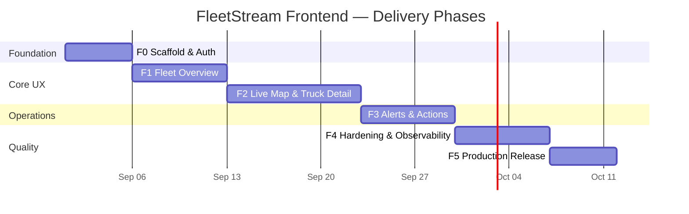

# 01 — Frontend Implementation Phases

> **Status:** 🟡 Draft  
> **Audience:** Product Owner, Solution Owner, Team Lead, engineering  
> **Goal:** Sequence Phase 4 (Frontend) into demonstrable deliverables with clear ownership, exit criteria, and cross-role dependencies.

---

## Executive summary

The FleetStream frontend is a **real-time fleet operations dashboard** for monitoring 10,000+ delivery trucks. It is Phase 4 of the platform and depends entirely on the BFF API (Phase 3) for data and real-time updates.

Delivery is organized into **six phases (F0–F5)**, each producing a shippable increment. Every phase defines deliverables from three perspectives:

| Perspective | Focus |
|---|---|
| **Product Owner (PO)** | User value, stories, demo criteria, acceptance |
| **Solution Owner (SO)** | Architecture, integration, NFRs, security, scalability |
| **Team Lead (TL)** | Engineering tasks, structure, CI, capacity, risks |

**Estimated duration:** ~8–10 weeks (2 engineers + 0.5 designer/PO support).

---

## Entry criteria (Phase 3 → Phase 4 gate)

Frontend work MUST NOT start until:

| # | Gate | Owner | Verification |
|---|---|---|---|
| G1 | BFF REST contract final | SO | `BffApi/docs/02-api-contract.md` → ✅ Final |
| G2 | SignalR protocol final | SO | `BffApi/docs/03-signalr-protocol.md` → ✅ Final |
| G3 | Staging BFF reachable | TL | `GET /swagger/v1/swagger.json` returns 200 from CI runner |
| G4 | Dev token flow works | TL | `POST /api/v1/auth/dev-token` returns JWT in `dev` profile |
| G5 | E2E data path live | SO | At least one truck producing telemetry through Ingress → Streaming → BFF |

---

## Phase overview



| Phase | Name | PO headline | Duration |
|---|---|---|---|
| **F0** | Scaffold & Auth | "I can log in and see an empty dashboard shell" | 1 week |
| **F1** | Fleet Overview | "I see fleet KPIs and a searchable truck list" | 1 week |
| **F2** | Live Map & Detail | "I watch trucks move on a map and drill into one" | 2 weeks |
| **F3** | Alerts & Actions | "I see and acknowledge fleet alerts in real time" | 1 week |
| **F4** | Hardening | "The app is fast, accessible, and observable" | 1 week |
| **F5** | Production Release | "The dashboard is deployed and signed off" | 1 week |

---

## F0 — Scaffold & Auth

### Product Owner (PO) perspective

**Objective:** Establish the product shell so stakeholders can authenticate and navigate the application structure.

| User story | Acceptance criteria |
|---|---|
| As an operator, I can sign in locally without a corporate IdP | Dev token flow obtains JWT; token stored securely; expired token redirects to login |
| As an operator, I see a branded dashboard layout with navigation | Header, sidebar/nav, main content area; responsive at ≥1280px and ≥768px |
| As a PO, I can demo "logged-in empty state" to stakeholders | Login → dashboard shell in < 30 s on fresh clone |

**Demo deliverable:** Recorded walkthrough — login → empty dashboard with nav placeholders.

**Out of scope:** Real fleet data, map, alerts.

---

### Solution Owner (SO) perspective

**Objective:** Lock technical foundation and BFF integration patterns before feature work.

| Deliverable | Specification |
|---|---|
| Next.js 15 App Router project | `frontend/` with strict TypeScript, ESLint, Prettier |
| Environment contract | `.env.example`: `NEXT_PUBLIC_BFF_URL`, `NEXT_PUBLIC_SIGNALR_HUB` |
| Auth module | JWT in memory + httpOnly refresh deferral; `Authorization: Bearer` on all BFF calls |
| OpenAPI type generation | Pipeline: fetch BFF swagger → generate client types (orval / openapi-typescript) |
| CORS alignment | Frontend origin registered in BFF `Cors:AllowedOrigins` ([05-security.md](../../BffApi/docs/05-security.md)) |
| Error model | RFC 7807 `ProblemDetails` rendered consistently |

**NFR targets (F0):**

- First Contentful Paint < 2 s on localhost
- No secrets in client bundle
- All API calls through typed client layer (no raw `fetch` in components)

**Architecture decision (proposed):**

```
frontend/
├── src/
│   ├── app/              # Next.js routes (RSC default)
│   ├── components/       # UI primitives + feature components
│   ├── lib/
│   │   ├── api/          # Generated + hand-written BFF client
│   │   ├── auth/         # Token acquisition, refresh, guards
│   │   └── signalr/      # Hub client (stub in F0)
│   └── types/            # Shared TS types
├── docs/
└── public/
```

---

### Team Lead (TL) perspective

**Objective:** Bootstrap repo, CI, and team conventions.

| Task | Owner | Done when |
|---|---|---|
| Initialize Next.js + Tailwind + shadcn/ui | FE-1 | `npm run dev` serves `/` |
| Configure path aliases, strict TS | FE-1 | `npm run typecheck` clean |
| Add GitHub Actions: lint, typecheck, build | FE-1 | Workflow green on PR |
| Wire dev-token login page | FE-2 | Manual test against local BFF |
| Add Playwright skeleton (smoke login test) | FE-2 | CI runs headless login |
| Document local setup in `frontend/README.md` | TL | New engineer productive in < 1 h |

**Exit criterion (F0):** CI green; PO demo recorded; auth E2E passes against `docker compose --profile dev up`.

**Capacity:** 2 FE engineers × 5 days.

**Risks:**

| Risk | Mitigation |
|---|---|
| BFF dev-token endpoint unavailable | Block F0; escalate to BFF team |
| OpenAPI schema unstable | Pin swagger snapshot in repo until G1 satisfied |

---

## F1 — Fleet Overview

### Product Owner (PO) perspective

**Objective:** Deliver the primary landing experience — fleet-wide KPIs and truck inventory.

| User story | Acceptance criteria |
|---|---|
| As an operator, I see fleet summary KPIs | Total/online/moving/idle/at-risk trucks; avg speed & fuel; refresh ≤ 10 s |
| As an operator, I browse trucks with pagination | Cursor pagination; 50 per page; filter by status (online/offline/moving) |
| As an operator, I search by truck name or plate | Client-side filter on current page; server filter deferred to F2 |
| As a PO, I can demo fleet health at a glance | Summary cards + sortable table populated from staging BFF |

**Demo deliverable:** Live staging demo with ≥100 simulated trucks.

**KPIs for sign-off:**

- Summary loads in < 3 s with 10k trucks in backend
- Table scroll performance: 60 fps on default page size

---

### Solution Owner (SO) perspective

**Objective:** Implement REST integration for read-only fleet data with efficient caching.

| Endpoint | Usage |
|---|---|
| `GET /api/v1/fleet/summary` | Summary cards; TanStack Query, 5 s stale time (matches BFF cache TTL) |
| `GET /api/v1/fleet/trucks` | Paginated table; cursor stored in URL search params |

| Deliverable | Detail |
|---|---|
| Server state layer | TanStack Query with query keys per resource |
| Summary dashboard route | `/` or `/fleet` — RSC wrapper + client widgets |
| Truck list component | Virtualized table (TanStack Virtual) for large pages |
| Loading / empty / error states | Skeleton UI; ProblemDetails toast |
| Role gating | Hide admin-only nav items based on JWT `roles` claim |

**NFR targets (F1):**

- API errors surfaced within 500 ms
- No SignalR yet — REST polling acceptable for summary (10 s interval)

---

### Team Lead (TL) perspective

| Task | Owner | Done when |
|---|---|---|
| Generate API client from OpenAPI | FE-1 | Types match BFF swagger snapshot |
| Implement `useFleetSummary` hook | FE-1 | Unit test with MSW mock |
| Build summary card grid | FE-2 | Storybook stories for all states |
| Build paginated truck table | FE-2 | Cursor next/prev works |
| Add MSW handlers for local dev without BFF | FE-1 | `npm run dev:mock` profile |
| Extend Playwright: summary + list smoke | FE-2 | CI green |

**Exit criterion (F1):** PO accepts staging demo; REST integration tests pass; Lighthouse Performance ≥ 80 on summary page.

**Capacity:** 2 FE × 5 days + PO review 0.5 day.

---

## F2 — Live Map & Truck Detail

### Product Owner (PO) perspective

**Objective:** Real-time situational awareness — the core differentiator of FleetStream.

| User story | Acceptance criteria |
|---|---|
| As an operator, I see all online trucks on a map | Markers update position without full page reload; color by risk level |
| As an operator, I click a truck to see live detail | Side panel: speed, temp, fuel, last seen, risk score |
| As an operator, I see online/offline status change | Marker icon updates within 10 s of backend state change |
| As an operator, the map remains usable during reconnect | Banner "Reconnecting…"; data resumes without manual refresh |
| As a PO, I can demo live fleet movement | Simulator running; ≥10 trucks moving on map simultaneously |

**Demo deliverable:** Live map demo with truck drill-down; reconnect scenario scripted.

---

### Solution Owner (SO) perspective

**Objective:** Integrate SignalR for push updates and design client-side state reconciliation.

| SignalR method | UI effect |
|---|---|
| `OnFleetUpdate` | Bulk marker refresh after reconnect |
| `OnTruckStateUpdate` | Single marker + open detail panel update |
| `OnPresenceChange` | Online/offline indicator |
| Client: `JoinFleetGroup` | Called on connect |
| Client: `JoinTruckGroup(id)` | Called when detail panel opens |
| Client: `RequestSnapshot` | Called on `onreconnected` |

| Deliverable | Detail |
|---|---|
| SignalR provider | Singleton hub connection; exponential backoff reconnect |
| Map layer | MapLibre/Leaflet with clustered markers at zoom < 12 |
| Truck detail route | `/fleet/trucks/[truckId]` — parallel REST bootstrap + SignalR stream |
| REST bootstrap | `GET .../trucks/{id}/state`, `GET .../trucks/{id}/telemetry` |
| State merge strategy | SignalR updates overwrite stale REST data by `timestamp` |
| Rate-limit UX | Throttle marker re-renders (max 1/truck/2 s per BFF contract) |

**NFR targets (F2):**

- Marker update latency: p95 < 3 s from BFF broadcast to pixel
- Hub reconnect + resubscribe < 5 s
- Map supports 500 visible markers at 30 fps

---

### Team Lead (TL) perspective

| Task | Owner | Done when |
|---|---|---|
| SignalR client module + connection hook | FE-1 | Unit tests for reconnect/resubscribe |
| Map component + marker layer | FE-2 | Clustering verified with 500 mock markers |
| Truck detail panel | FE-2 | REST + SignalR merge tested |
| Telemetry sparkline (24 h window) | FE-1 | Uses `/telemetry` endpoint |
| E2E: map load + click truck + see update | FE-2 | Playwright with mocked hub or staging |
| Performance budget check | TL | Bundle analyzer; map chunk lazy-loaded |

**Exit criterion (F2):** PO live demo on staging; SignalR integration test passes; no memory leak over 30 min soak.

**Capacity:** 2 FE × 10 days.

**Risks:**

| Risk | Mitigation |
|---|---|
| SignalR backpressure disconnects | Implement `RequestSnapshot` on reconnect per protocol |
| Map perf with 10k trucks | Cluster + viewport culling; only subscribe visible truck groups |

---

## F3 — Alerts & Actions

### Product Owner (PO) perspective

**Objective:** Enable operators to monitor and act on fleet anomalies.

| User story | Acceptance criteria |
|---|---|
| As an operator, I see a live alert feed | New alerts appear without refresh; severity badges; timestamp |
| As an operator, I filter alerts by severity/truck | Filters apply client-side on ring buffer |
| As an operator, I acknowledge an alert | `POST .../alerts/{id}/acknowledge`; UI reflects ack state |
| As an admin, I see telemetry-full stream | Optional — gated by `fleet:admin` role |
| As a PO, I can demo alert → ack workflow | Staging anomaly triggers alert; operator acks in UI |

**Demo deliverable:** Alert feed with live injection + acknowledge flow.

---

### Solution Owner (SO) perspective

| SignalR method | UI effect |
|---|---|
| `OnAlert` | Prepend to alert feed; toast for Critical |
| `OnAlertsPurged` | Trim local buffer; show info banner |

| REST endpoint | Usage |
|---|---|
| `GET /api/v1/fleet/alerts` | Initial load + pagination |
| `POST /api/v1/fleet/alerts/{id}/acknowledge` | Ack action; requires `alerts:ack` role |

| Deliverable | Detail |
|---|---|
| Alert feed component | Ring buffer max 500 entries |
| Ack action | Optimistic UI + rollback on 4xx/5xx |
| Role-based UI | Ack button hidden without `alerts:ack` |
| Alert count badge in nav | Derived from unread/unacked count |

---

### Team Lead (TL) perspective

| Task | Owner | Done when |
|---|---|---|
| Alert store (Zustand) | FE-1 | Unit tests for ring buffer + purge |
| Alert feed UI | FE-2 | Virtualized list |
| Ack API integration | FE-1 | MSW + staging tests |
| SignalR `OnAlert` wiring | FE-1 | E2E alert appears test |
| Authorization guard on ack button | FE-2 | Test with reader vs admin tokens |

**Exit criterion (F3):** PO accepts alert demo; role gating verified; ack E2E passes.

**Capacity:** 2 FE × 5 days.

---

## F4 — Hardening & Observability

### Product Owner (PO) perspective

**Objective:** Production-quality UX — performance, accessibility, resilience.

| User story | Acceptance criteria |
|---|---|
| As an operator with a screen reader, I can navigate all primary flows | WCAG 2.1 AA on summary, map, alerts |
| As an operator on a slow network, I see meaningful loading states | Skeleton UI; offline banner; retry actions |
| As a PO, I can trust uptime metrics | Error rate < 1% in staging soak week |

**Demo deliverable:** Accessibility audit report + performance dashboard screenshot.

---

### Solution Owner (SO) perspective

| Area | Deliverable |
|---|---|
| Performance | Route-level code splitting; map + chart lazy load; LCP < 2.5 s |
| Accessibility | Focus management, ARIA labels, color-contrast ≥ 4.5:1 |
| Error handling | Global error boundary; hub disconnect banner; API retry with jitter |
| Observability | Client OTEL or structured logging; `correlationId` forwarded from BFF responses |
| Security | CSP headers; no JWT in localStorage (memory + secure cookie path for prod OIDC) |
| i18n readiness | String extraction (English only for v1) |

**NFR targets (F4):**

- Lighthouse: Performance ≥ 85, Accessibility ≥ 90, Best Practices ≥ 90
- Bundle size: initial JS < 300 KB gzipped (excluding map chunks)

---

### Team Lead (TL) perspective

| Task | Owner | Done when |
|---|---|---|
| axe-core in CI | FE-2 | Zero critical violations on key routes |
| k6 or Playwright perf smoke | FE-1 | Summary TTFB budget met |
| Error boundary + retry UI | FE-2 | Chaos test: BFF down → graceful degrade |
| OTEL browser SDK | FE-1 | Traces visible in staging Grafana |
| Storybook coverage ≥ 80% components | FE-2 | Visual regression optional |

**Exit criterion (F4):** Lighthouse gates pass in CI; 7-day staging soak without Sev-1.

**Capacity:** 2 FE × 5 days + QA 2 days.

---

## F5 — Production Release

### Product Owner (PO) perspective

**Objective:** Go-live readiness and stakeholder sign-off.

| Deliverable | Acceptance |
|---|---|
| Release notes | Feature list F0–F4; known limitations documented |
| Operator quick-start guide | 1-page PDF / in-app help |
| Production sign-off | PO + SO written approval |

---

### Solution Owner (SO) perspective

| Deliverable | Detail |
|---|---|
| Production deployment | Static export or Node SSR behind CDN; TLS via platform ingress |
| OIDC integration | Replace dev-token with corporate IdP (config-driven) |
| Environment matrix | dev / staging / prod env vars documented |
| Runbook | Rollback procedure; hub outage playbook |
| Cross-link to platform docs | Entry in [docs/production-readiness-report.md](../../docs/production-readiness-report.md) |

---

### Team Lead (TL) perspective

| Task | Owner | Done when |
|---|---|---|
| Dockerfile + CI publish | FE-1 | Image in registry; deploy to staging |
| GitHub Actions deploy workflow | FE-1 | Manual promote to prod |
| Production E2E suite | FE-2 | Runs against prod smoke tenant |
| Frontend checklist | TL | [production-readiness-checklist.md](../../docs/frontend/production-readiness-checklist.md) complete |
| Hand-off session | TL | Backend + SRE + PO walkthrough recorded |

**Exit criterion (F5):** Production deployed; checklist signed; PO demo to stakeholders.

**Capacity:** 2 FE × 5 days + SRE 2 days.

---

## Cross-phase dependency matrix

| Phase | Depends on | Blocks |
|---|---|---|
| F0 | BFF G1–G4 | F1–F5 |
| F1 | F0, BFF summary + trucks endpoints | F2 |
| F2 | F1, BFF SignalR hub live | F3 |
| F3 | F2, BFF alerts + ack endpoint | F4 |
| F4 | F3 | F5 |
| F5 | F4, platform TLS + OIDC | — |

---

## Role responsibilities summary

| Activity | PO | SO | Team Lead |
|---|---|---|---|
| Prioritize user stories | **R** | C | I |
| Define acceptance criteria | **R** | C | C |
| Architecture & NFRs | I | **R** | C |
| BFF contract alignment | C | **R** | I |
| Sprint planning & task breakdown | C | C | **R** |
| CI/CD & repo standards | I | C | **R** |
| Demo & sign-off | **R** | C | C |
| Production go/no-go | **A** | **A** | **R** |

*R = Responsible, A = Accountable, C = Consulted, I = Informed*

---

## Definition of done (Phase 4 complete)

- [ ] All phases F0–F5 exit criteria verified and recorded in PR/release notes
- [ ] PO and SO written sign-off on production release
- [ ] Frontend row added to [production-readiness-report.md](../../docs/production-readiness-report.md) as production-ready
- [ ] 7 consecutive days staging soak without Sev-1
- [ ] Operator documentation published
- [ ] Decision log below reviewed; open items tracked or closed

---

## Decision log

| # | Date | Decision | Status | Rationale |
|---|---|---|---|---|
| D1 | 2026-08-31 | Next.js 15 App Router for Phase 4 | Proposed | Aligns with ingress/streaming README; RSC + client islands fit dashboard |
| D2 | 2026-08-31 | TanStack Query for server state | Proposed | Cursor pagination + cache invalidation; industry standard |
| D3 | 2026-08-31 | MapLibre over Google Maps | Proposed | No API key dependency; offline-friendly |
| D4 | 2026-08-31 | Dev-token only until F5 | Proposed | Unblocks F0–F4; OIDC at production cutover |
| D5 | 2026-08-31 | Six phases F0–F5 | Proposed | Each phase independently demoable to PO |

---

## Acceptance criteria for this document

- [ ] PO reviews user stories and demo deliverables per phase
- [ ] SO confirms BFF integration mapping and NFR targets
- [ ] Team Lead assigns engineers and dates when F0 starts
- [ ] Phase 4 entry gate (G1–G5) status recorded before F0 kickoff
